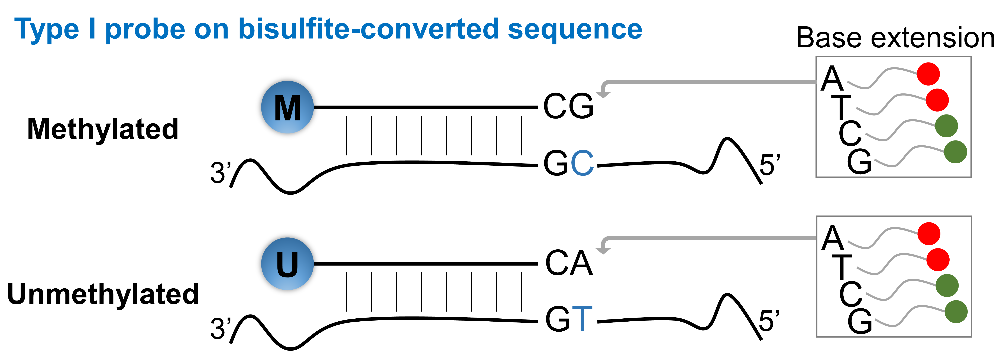
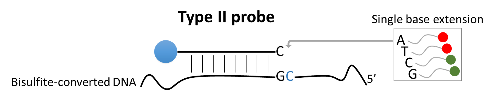

```{r setup, include = FALSE}
knitr::opts_chunk$set(
  echo = TRUE,
  collapse = TRUE,
  comment = "#>"
)
```

## Introduction

The `MethylGenotyper` package provides functions to infer genotypes (produce a standard VCF file) for specific probes and on Illumina methylation array (EPIC or 450K). Three types of candidate probes are used for genotype calling, including SNP probes, Type I probes with color-channel-switching (CCS) SNPs at the extension bases, and Type II probes with SNPs at the extension bases.

Here is a detailed information about the three candidate probes:

### SNP probe

There are 59 SNP probes (started with "rs") on EPIC array and 65 SNP probes on 450K array. Probes on sex chromosomes (six in EPIC and eight on 450K) are removed. These probes are specifically designed to target common SNPs and facilitate genotype calling for sample swapping checks.

### Type I probe

Type I probe uses two types of probes at each CpG locus: **M** for methylation and **U** for unmethylation. The **M** probe ends with bases `CG`, while the **U** probe ends with bases `CA`. After bisulfite conversion, methylated base `C` remains unchanged and binds with **M** probe, while unmethylated base `C` changes to `T` and binds with **U** probe. Then, the probes binding with DNA sequences will extend a single base. If the extended base is `A` or `T`, a red color will be detected. If the extended base is `C` or `G`, a green color will be detected. SNPs (except for A/T and G/C SNPs) at the extension base will cause color channel switching (CCS), thus out-of-band signals will be detected. We focus on Type I probes with CCS SNPs (A,T \<-\> C,G mutation) at the extension bases.



### Type II probe

Type II probes use a single bead at each CpG locus, with the extension base occurring at the target CpG. After bisulfite conversion, the red-labeled `A` and green-labeled `G` nucleotides will bind to the unmethylated and methylated alleles, respectively. In the presence of a SNP at the target CpG, a red color will be detected if the target `C` allele is mutated to `A` or `T` despite no effect of bisulfite conversion. On the other hand, a green color will remain detected if `C` is mutated to `G`. We focus on Type II probes with SNPs at the extension bases (CpG target sites).



## Workflow of MethylGenotyper

Here is a brief overview of the steps in MethylGenotyper:

- Extract candidate probes and perform noob and dye-bias corrections.
- Calculate `RAI` for each candidate probe and study sample.
- Filter probes based on the distribution of `RAI`.
- Model the distribution of `RAI` with a mixed model and solve it with an Expectation-Maximization (EM) algorithm.
- Call genotypes for each probe types.
- Quality control of genotypes.

We will now introduce the workflow in detail, providing R code to illustrate the procedure:

### Load the MethylGenotyper package

This package has the following dependencies: `minfi`, `tidyverse`, `foreach`, `doParallel`, `HardyWeinberg`, `multimode`, `rlist`, `stats4`, `ggplot2`, `ggpubr`.

```{r MethylGenotyper, eval=FALSE, message=FALSE, warning=FALSE}
library(MethylGenotyper)
```

### Read IDAT files and perform noob and dye-bias correction

MethylGenotyper supports two types of input: raw data (IDAT files) or preprocessed data ($\beta$-value or M-value matrix).

- If the input is raw data, MethylGenotyper extracts candidate probes and performs noob and dye-bias corrections.
- If the input is preprocessed data, MethylGenotyper assumes that noob and dye-bias corrections are already done, so you can skip this step.

We start with reading the IDAT file list. Here is an example of processing three IDAT files from `minfiDataEPIC`. Note that this is just an exemplification of how this tool works. We strongly recommend to use a larger sample size to test the code, such as [GSE112179](https://www.ncbi.nlm.nih.gov/geo/query/acc.cgi?acc=GSE112179). Your may process your own data by specifying your target file list. Required collumns: `Sample_Name`, `Basename`.

```{r rgSet, eval=FALSE, warning=FALSE, message=TRUE}
target <- get_target(platform="EPIC")
head(target)
#>   Sample_Name          Basename
#> 1     sample1  /path/to/sample1
#> 2     sample2  /path/to/sample2
#> 3     sample3  /path/to/sample3
```

With the following code, the IDAT files listed in `target` will be read one-by-one. For each sample, candidate probes will be extracted and a noob background correction and a dye-bias correction will be conducted. You can specify the number of CPUs to enable parallel processing. After that, a list of four elements will be returned, including corrected signals of probe `A` and probe `B` for the two color channels.

```{r correct_noob_dye, eval=FALSE, warning=FALSE, message=FALSE}
rgData <- correct_noob_dye(target, cpu=3)
```

### Call genotypes

This section includes calculating `RAI`, filtering probes, fitting the mixed model, calling genotypes, and quality control.

**Calculate `RAI`**: We defined `RAI` as the Ratio of Alternative allele Intensity to total intensity and calculated `RAI` for each probe and sample. For SNP probe, `RAI` is defined as the proportion of probe signals supporting alternative allele. For Type I probe, `RAI` is defined as the proportion of out-of-band signals over total signals. For Type II probe, the alternative allele of SNP can be either A/T (CCS SNP) or G (SNP not switching color channel). Please refer to the manuscript for details in calculating `RAI`.

**Filter probes**: We filter probes according to the distribution of `RAI`. For Type I probe, we keep probes with at least 2 modes. For Type II probes, we keep probes with at least 3 modes. Any probes with SNP minor allele frequency (MAF) < 0.01 in the corresponding population are removed.

**Fit the mixed model**: The `RAI` values are usually distributed with three peaks, representing the three genotypes (reference homozygous, heterozygous, and alternative homozygous). To call genotypes from the `RAI` values, we fit a mixture of three beta distributions for the three genotypes and a uniform distribution for background noise based on the EM algorithm. Probe-specific weights derived from allele frequencies (AFs) were used in the EM algorithm. The EM algorithm aims to solve the parameters of the mixed model and calculate genotype probabilities $\hat{P}_{ijk}$ and background probabilities $\hat{\Lambda}_{ij}$.

**Call genotypes**: With the estimated genotype probabilities $\hat{P}_{ijk}$ and background probabilities $\hat{\Lambda}_{ij}$, we set genotypes with $\hat{\Lambda}_{ij} > max_{0 \leq k \leq 2}{\hat{P}_{ijk}}$ as missing and then update each $\hat{P}_{ijk}$ by dividing it with $(1-\hat{\Lambda}_{ij})$ to make sure $\sum_{k=0}^{2}\hat{P}_{ijk}=1$ for any probe $i$ and sample $j$. For the other non-missing genotypes, we denote the $\hat{G}_{ij}$ as the most probable genotype and $\hat{D}_{ij}=\sum_{k=0}^{2}k\hat{P}_{ijk}$ as the genotype dosage.

**Quality control**: We compute the AF $\hat{q}_i$ and the dosage $\hat{R_i^2}$ as:

-   $\hat{q}_i = \frac{\sum_{j=1}^n\hat{D}_{ij}}{2n}$, where $n$ is the sample size
-   $\hat{R}_i^2 = \frac{Var(\hat{D}_{ij})}{2\hat{q}_i(1-\hat{q}_i)}$

We calculate SNP-level missing rate as the proportion of genotypes being missing or with $max_{0 \leq k \leq 2}{\hat{P}_{ijk}}<0.9$. To ensure the data quality, we exclude SNPs with MAF < 0.01, Hardy-Weinberg Equilibrium p-value < $10^{-6}$, $\hat{R}_i^2<0.75$, $\hat{R}_i^2>1.1$, or missig rate > 0.1.

The genotype-calling procedure can be done for SNP probes, Type I probes, and Type II probes, separately. All of the steps above have been wrapped into a single R function. For each probe type, a standard VCF file containing dosage genotype ($\hat{D}_{ij}$), AF ($\hat{q}_i$), and $\hat{R}_i^2$ will be produced.

You should specify the correct population (One of EAS, AMR, AFR, EUR, SAS, and ALL) for your samples to get accurate genotype calls. If you have samples of mixed population, please specify the population with the largest sample size or use `pop="ALL"`.

You can plot the distribution of the `RAI` values and produce a VCF file of the inferred genotypes by specifying `plotBeta=TRUE` and `vcf=TRUE`.

You can also specify cutoffs of $R^2$, MAF, HWE, and missing rate to filter variants. Note that for VCF output, variants beyond the cutoffs will be marked in the `FILTER` column.

We noted that in the example data, most of variants have $R^2$=0. This is because we only used three samples here. Again, we strongly recommend to use a larger sample size to test the code, such as [GSE112179](https://www.ncbi.nlm.nih.gov/geo/query/acc.cgi?acc=GSE112179).

```{r callGeno, eval=FALSE, warning=FALSE, message=FALSE}
# Call genotypes for SNP probes, Type I probes, and Type II probes
genotype_snp <- callGeno_snp(rgData, input="raw", vcf=TRUE, pop="EAS")
genotype_typeI <- callGeno_typeI(rgData, vcf=TRUE, pop="EAS")
genotype_typeII <- callGeno_typeII(rgData, input="raw", vcf=TRUE, pop="EAS")

# Combine genotypes inferred from the three probe types
dosage <- rbind(genotype_snp$dosage, genotype_typeI$dosage, genotype_typeII$dosage)
```

As an alternative option, you can input a matrix of beta values or M values, with each row indicates a probe and each column indicates a sample. This option only works for SNP probes and Type II probes. Here are the examples of calling genotypes from beta values. For input of M values, please specify `input="mval"`. Remember to conduct background correction and dye-bias correction before running the following code. Also be noted that other correction should NOT be conducted, like BMIQ, as it flattens the peaks through a scale transformation.

```{r callGeno2, eval=FALSE, warning=FALSE, message=FALSE}
# Call genotypes for SNP probes and Type II probes
genotype_snp <- callGeno_snp(beta_matrix, input="beta", vcf=TRUE, pop="EAS")
genotype_typeII <- callGeno_typeII(beta_matrix, input="beta", vcf=TRUE, pop="EAS")

# Combine genotypes inferred from the two probe types
dosage <- rbind(genotype_snp$dosage, genotype_typeII$dosage)
```

### Infer population structure and individual-specific AFs for mixed population

For samples of mixed population, we provided an option to infer population structure and calculate individual-specific AFs.

**Project the study samples to reference ancestral space:** Principal Components Analyses (PCA) are conducted in 1KGP individuals (the ancestral space) and a combination of 1KGP individuals and each study sample. Projection Procrustes analyses are then conducted to project each study sample to reference ancestral space. This step was originally implemented by the TRACE software and we have adapted it in R ([Wang et al. Nat Genet 2014](https://www.nature.com/articles/ng.2924), [Wang et al. Am J Hum Genet 2015](http://dx.doi.org/10.1016/j.ajhg.2015.04.018)).

```{r projection, eval=FALSE, warning=FALSE, message=FALSE}
# PCA and Procrustes analysis, based on genotypes of all probes passing QC
pc <- projection(dosage, plotPCA=TRUE, cpu=3)
```

**Estimate individual-specific AFs:** For each SNP, we model genotypes of the reference individuals as a linear function of top four PCs ($v_\cdot$): $G\sim\beta_0+\beta_1v_1+\beta_2v_2+\beta_3v_3+\beta_4v_4$. Then, the individual AF ($q$) for each SNP and each sample can be obtained by: $\hat{q}=\frac{1}{2}(\hat{\beta_0}+\hat{\beta_1}\hat{v_1}+\hat{\beta_2}\hat{v_2}+\hat{\beta_3}\hat{v_3}+\hat{\beta_4}\hat{v_4})$, where $\hat{v}_\cdot$ are top four PCs in study samples. ([Dou et al. PLoS Genet 2017](https://journals.plos.org/plosgenetics/article?id=10.1371/journal.pgen.1007021))

```{r indAF, eval=FALSE, warning=FALSE, message=FALSE}
data(cpg2snp)
snpvec <- cpg2snp[c(
  rownames(genotype_snp$genotypes$RAI), 
  rownames(genotype_typeI$genotypes$RAI), 
  rownames(genotype_typeII$genotypes$RAI)
)]
indAF <- get_indAF(snpvec, pc$refPC, pc$studyPC)
```

<!-- **Recalibrate genotype probabilities based on individual-specific AFs: ** This step is based on the Bayesian approach, which can be implemented by using the `get_GP_bayesian` function. -->

<!-- ```{r recal_geno, eval=FALSE, warning=FALSE, message=FALSE} -->
<!-- # Recalibrate genotypes for SNP probes, Type I probes, and Type II probes -->
<!-- genotype_snp_recal <- recal_Geno(genotype_snp, type="snp_probe", indAF=indAF) -->
<!-- genotype_typeI_recal <- recal_Geno(genotype_typeI, type="typeI_probe", indAF=indAF) -->
<!-- genotype_typeII_recal <- recal_Geno(genotype_typeII, type="typeII_probe", indAF=indAF) -->

<!-- # Combine genotypes inferred from the three probe types -->
<!-- dosage_recal <- rbind(genotype_snp_recal$dosage, genotype_typeI_recal$dosage, genotype_typeII_recal$dosage) -->
<!-- ``` -->

### Estimate kinship relationships and inbreeding coefficients

With the inferred genotypes, you can estimate kinship coefficients using the SEEKIN software ([Dou et al. PLoS Genet 2017](https://journals.plos.org/plosgenetics/article?id=10.1371/journal.pgen.1007021)), which has been wrapped in MethylGenotyper: the $SEEKIN_{hom}$ estimator for homogeneous samples and the $SEEKIN_{het}$ estimator for heterogeneous samples can be invoked by the `getKinship` and `getKinship_het` function, respectively.

**For homogeneous samples**, you can use the `getKinship` function, which uses a matrix of genotype dosages as input and produces a list of two elements: 1) a data frame containing kinship coefficients ($\phi$) and kinship relationships between each two samples; 2) a vector of inbreeding coefficients.

This formula illustrates the calculation of kinship coefficients from homogeneous samples:

$$2\hat{\phi}_{ij} = \frac{\sum_m(\hat{G}_{im}-2\hat{q}_m)(\hat{G}_{jm}-2\hat{q}_m)}{\sum_m{2\hat{q}_m(1-\hat{q}_m)(\hat{R}_m^2)^2}}$$
where $\hat{\phi}_{ij}$ denotes the kinship coefficient between $i$-th and $j$-th sample. $\hat{G}_{im}$ and $\hat{G}_{jm}$ denotes genotypes of $m$-th SNP for $i$-th and $j$-th sample. $\hat{q}_m$ denotes AF of $m$-th SNP. $\hat{R}^2$ is calculated as $\hat{R}^2 = \frac{Var(\hat{D})}{2\hat{q}(1-\hat{q})}$, where $\hat{D}$ is the dosage genotype.

Inbreeding coefficients are calculated as: $\hat{F}=2\hat{\phi}_{ii}-1$, where $\hat{\phi}_{ii}$ is the self-kinship coefficient for sample $i$.

```{r getKinship, eval=FALSE, warning=FALSE, message=FALSE}
res <- getKinship(dosage)
kinship <- res$kinship # kinship coefficients
inbreed <- res$inbreed # inbreeding coefficients
```

**For heterogeneous samples**, you can use the `getKinship_het` function, which uses a matrix of genotype dosages and a matrix of individual-specific AFs as input and produces a data frame containing kinship coefficients ($\phi$) and kinship relationships between each two samples.

This formula illustrates the calculation of kinship coefficients from heterogeneous samples:

$$2\hat{\phi}_{ij} = \frac{\sum_m(\hat{G}_{im}-2\hat{q}_{im})(\hat{G}_{jm}-2\hat{q}_{jm})}{\sum_m{2\sqrt{\hat{q}_{im}(1-\hat{q}_{im})\hat{q}_{jm}(1-\hat{q}_{jm})}(\hat{R}_m^2)^2}}$$
where $\hat{q}_{im}$ and $\hat{q}_{jm}$ denote individual-specific AFs of $m$-th SNP for $i$-th and $j$-th sample, which can be estimated from the last step.

```{r getKinship_het, eval=FALSE, warning=FALSE, message=FALSE}
kinship <- getKinship_het(dosage, indAF) # kinship coefficients
```

We classified sample pairs as k-degree related if $2^{-k-1.5} < \hat{\phi}_{ij} < 2^{-k-0.5}$ ([Manichaikul et al. Bioinformatics 2010](https://academic.oup.com/bioinformatics/article/26/22/2867/228512)). A zero-degree related pair means monozygotic twins (MZ) or duplicates. Sample pairs more distant than 3rd degree are treated as unrelated. 

